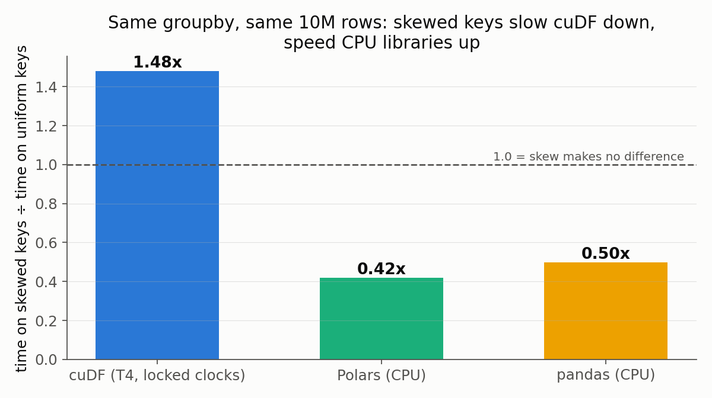
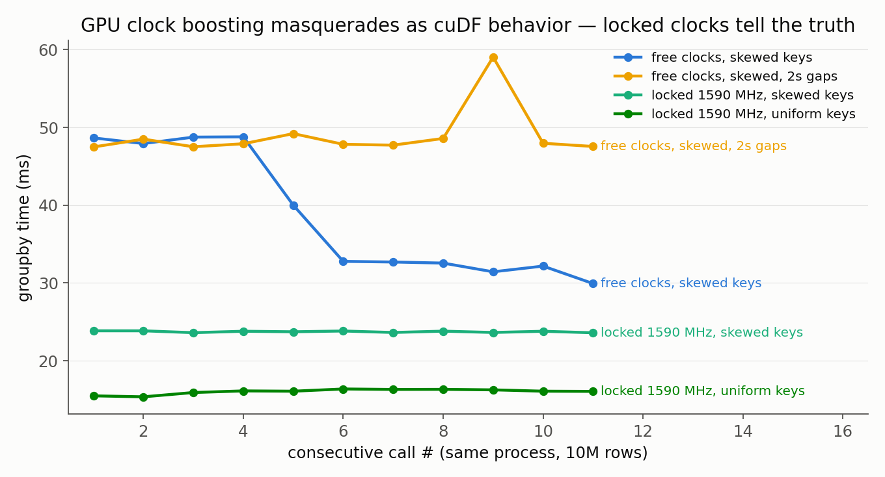

# Findings

> Reported upstream: [rapidsai/cudf#23256](https://github.com/rapidsai/cudf/issues/23256)

Investigation of NVIDIA cuDF `groupby.agg` performance on skewed keys.
All numbers reproducible from committed CSVs in `results/`; every experiment is a
notebook/script in this repo. Hardware: Google Colab Tesla T4, cudf 26.02.01.

## Headline result

**cuDF's hash groupby is ~1.48x slower on skewed (Zipf 1.5) keys than on uniform
keys — measured at locked GPU clocks with a preallocated memory pool — while CPU
libraries (pandas, Polars) get ~2x *faster* on the same skewed input.**



| condition (10M rows, 100k nominal keys, T4 @ locked 1590 MHz) | groupby time |
|---|---|
| uniform keys | 16.0 ms |
| Zipf(1.5) keys | 23.7 ms |

Steady-state medians over 11 in-process calls; per-call data in `results/transient3.csv`.

## Proposed mechanism (source-backed hypothesis)

libcudf's hash groupby has a fast path that aggregates in **shared memory**, added
to fix exactly the problem skew creates — "serializing atomic operations over a
small range of global memory" ([#15262](https://github.com/rapidsai/cudf/issues/15262)).
The path is gated **per thread block** on the count of distinct keys the block
sees: [`GROUPBY_CARDINALITY_THRESHOLD = 128`](https://github.com/rapidsai/cudf/blob/main/cpp/src/groupby/hash/helpers.cuh)
(see `compute_single_pass_aggs.cuh`).

Zipf-skewed keys are the worst case for this gate: the **long tail** pushes each
block's distinct-key count past 128 (fast path disabled), while the **hot head**
concentrates most row updates onto a few global-memory addresses (atomic
serialization maximized). Consistent controls:

- 10 uniform keys, 10M rows → *fastest* config measured (shared-memory path engages)
- 100k uniform keys → fast (atomics spread across 100k addresses; little contention)
- Zipf 1.5 over 100k keys → slow (path disabled + updates concentrated)
- `sort` on identical data → no skew penalty (no hash aggregation involved)

The cardinality gate measures *how many* keys a block sees, not *how concentrated*
the updates are — and only the latter determines atomic contention.

## Finding 2 (methodological): DVFS contaminates naive GPU benchmarks



The T4 idles at **585 MHz** and boosts to ~1590 MHz only after ~6 back-to-back
kernel-heavy calls (`results/transient3.csv`, per-call SM clock logged via NVML):

- benchmark loops that run an op back-to-back measure **boost-clock** performance;
- single-shot usage — how real users call groupby — runs at **idle clocks**, up to
  2x slower;
- 2s of idle between calls keeps the GPU at 585 MHz indefinitely: the "warm-up"
  never completes.

During diagnosis this artifact produced a convincing-but-false dose–response
(apparent extra slowdown from unused string columns, `results/probe.csv`) — the
extra H2D transfer time changed the clock state entering the timed region. Locking
clocks (`nvidia-smi -lgc`) removed it. Rep-by-rep logging (never just medians) is
what exposed the confound.

## Dead hypotheses (and what killed them)

| hypothesis | killed by |
|---|---|
| atomic contention from few big groups per se | 10-uniform-keys control = fastest cell (`results/sweep.csv`) |
| memory-pool growth causes the per-call transient | transient survives 8 GiB preallocated pool (`results/transient.csv`) |
| CPU-side overhead | CUDA-event GPU time == wall time on every call (`results/transient2.csv`) |
| unused string columns slow the kernel | effect vanishes at locked clocks — DVFS artifact (`results/transient3.csv`) |

## Reproduce

```bash
# CPU parts (any machine)
pip install -e . && pytest
# GPU parts: open notebooks/colab_run.ipynb in Colab (T4), Run all
# figures
python scripts/make_figs.py
```

## Route B: prototype proof (benchmark/routeb.py)

A heavy-hitter-aware aggregation (hot keys in per-block shared memory, tail keys
in a dense direct-indexed table) computes the identical groupby result
(asserted against cuDF's output) **2.47x faster on skewed keys** (11.6 ms vs
28.6 ms at Zipf 1.5; 15.5 vs 38.4 at Zipf 2.0; T4, locked clocks —
`results/routeb.csv`).

Honest scope: the prototype exploits dense integer keys (direct indexing, no
hash table), a specialization a general-purpose library cannot assume — it also
wins on uniform keys for that reason. What it demonstrates is the
contention-free *structure* (frequency-aware routing of hot vs tail keys) that
rapidsai/cudf#23256 proposes gating into libcudf's hash groupby.
